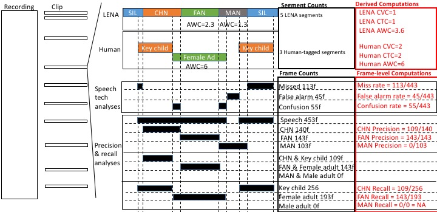

```{r setup, include=TRUE,echo=F,warning=FALSE}

knitr::opts_chunk$set(warning = FALSE, message = FALSE, cache = FALSE, fig.pos = "T")
require("papaja")
thisdir=c("../LENA_eval_201906/")
library(lme4)
library(sm)
library(scales)
library(ggpubr)
library(ggplot2)
library(car)

dodiv=function(x) x/sum(x, na.rm=T)

#source("XXs.R")
#read.table("XX",header=T)->data
```


### Brief introduction to LENA(R) products

### Previous validation work


### Present work

## Methods

### Corpora

The data for the evaluation comes from two different projects. The largest one is the ACLEW project (Bergelson et al., 2017b Databrary volume; Soderstrom et al AMPPS under review); in this paper we focus on four different corpora of child daylong recordings that have been pooled together, sampled, and annotated in a coordinated manner. These four corpora are: the Bergelson corpus (“BER”) from US English families from the upstate New York area (Bergelson, 2016), the LuCiD Language 0–5 corpus (“L05”) consisting of English-speaking families from Northwest England (Rowland et al., 2018), the McDivitt and Winnipeg corpora ( “MCD”) of Canadian English families (McDivitt & Soderstrom, 2016), and the Warlaumont corpus (“WAR”) of US English from Merced, California (Warlaumont et al., 2016). Some recordings in BER, and all recordings in MCD and WAR are available from HomeBank repository (VanDam et al., 2016). The second project contains a single corpus collected from Tsimane' speaking families in Bolivia (Scaff et al., in prep.; here "TSI").

Key properties of the five corpora are summarized in Table 2. Each corpus consists of daylong (4–16 hour) at-home recordings; each corpus samples from a unique community. Corpora span languages and dialects; socioeconomic environment varying both within and across corpora. In each recording, the key child (“participant”) wears a LENA recorder in a special vest throughout a normal day. 

For the four ACLEW corpora, out of the 106 recorded participants, daylong recordings from 10 infants from each corpus were chosen for manual annotation, selected to represent a diversity of ages (0–36 months) and socio-economic contexts. In the SOD corpus, sensitive information was found in one of the files, and thus one child needed to be excluded. The tenth day for this corpus was a second day by one of the 9 included children. From each daylong file, fifteen 2-minute non-overlapping audio (with a 5-minute context window) were randomly sampled from the entire daylong timeline for manual annotation. This 30 minute sample corresponded to approximately 1 minute of annotated speech per key child (collapsing across all speaker categories). 

The TSI corpus consisted of 1-2 daylong recordings from 12 infants, out of the 25 recorded from field work that year; the other 13 had been recorded using other devices (not the LENA DLP). From these daylong files, 1-minute segments were sampled in a period fashion. That is, for each day, we skipped the first 33 minutes to allow the family to acclimate to the recorder, and then extracted 1 minute (with a 5-minute context window) every 60 minutes, until the end of the recording was reached. This resulted in 4 to 16 minutes of manually annotated audio per child per recording (mean = 12.64 minutes), and an average of 3 minutes of speech per key child (collapsing across all speaker categories).

We chose to sample 1 or 2 minutes at a time (Tsimane, and ACLEW corpora, respectively) because conversations are likely to be bursty (Goh & Barbasi; cf. Slone et al Fausey et al ICIS18 session). That is, it is likely the case that speech is not produced at a periodic rate (e.g., one phrase every 20 seconds), but rather it occurs in bursts (a conversation is followed by a long period of silence between the conversational partners, followed by another bout of conversation, perhaps with different interlocutors, followed by silence, and so on). In this context, imagine that you sample a 5-second stretch. If you find speech in that stretch, then it is likely you have by chance fallen on a conversation bout; if you do not find speech, then you have likely found a silence bout. If you were to extend that selection out to several minutes, then it is likely that you will simply add more material from the same type (i.e. conversation bout or silence bout). As a result, any sampling method that favors medium-sized stretches (5-15 minutes) will tend to end up with samples that are internally homogeneous (throughout the 5 minutes, there is a conversation), but highly heterogeneous as a collection if sampling is random throughout the day. This in turn would lead to artificially high correlations between LENA and human metrics in all dependent variables (e.g., since probably little speech, fewer turns, and fewer child vocalizations will be found in silent bouts and more in conversational ones). Thus, our strategy of sampling randomly/periodically and in short stretches is more likely to represent both conversational and short bouts, and to capture finer-grained variation in speech quantity.

In the 5 corpora, the 1- or 2-min samples were annotated for all hearable utterance boundaries and talker ID. In ACLEW corpora \footnote{see Casillas et al., 2017a, 2017b for the general annotation protocol, and Soderstrom et al., submitted to AMPPS, for an introduction to the databases}, talker IDs reflected unique individual talkers, but were coded in such a way to readily allow mapping onto LENAs talker categories (e.g. key child, other children, female adult, male adult). In the TSI corpus, only the key child and one female adult whose voice recurred throughout the day were individually identified, with all other talkers being classified on the basis of broad age and sex into male adult, female adult, and other children. The ACLEW datasets had other coding levels which will not be discussed here. 


### Processing

Several different time units are needed to clarify how different metrics are calculated (see Figure XX). Clips refer to the 1- or 2-minute samples extracted from recordings. This is the basic unit at which child vocalization counts and conversational turn counts can be established. In addition, since most previous work evaluating adult word counts did so at the clip level, we do so here as well.



The other metrics require a more detailed explanation, conveyed graphically in Figure XX. The stretch of time that has been assigned to a speech or non-speech category by LENA is a segment. In one clip, there may be just one long segment (e.g., the whole clip has been assigned to Silence by LENA); or there may be more (e.g., the first 5 seconds are attributed to the key child, then there is a 50-second Silence segment, and the final 5 seconds are attributed to a Female Adult). In LENA's automated analysis, only one of these categories may be active at a given point in time. In contrast, we typically speak of utterances or vocalizations to refer to stretches of speech detected by humans and assigned to different talkers. Again, clips may have zero or more utterances. Unlike LENA, however, a given point in time may be associated with multiple speakers. 
Given that there need not be a one-to-one correspondence between LENA segments and human utterances, we need to define smaller time units that can be used to check for agreement. In this paper, we use 10 ms frames. This is the basic time unit used for all classification accuracy estimations, which are introduced in more detail in the next subsection.


### LENA classification accuracy

Our first  goal was to establish LENA talker tag accuracy, particularly for the four broad LENA talker categories (key child, other child, female adult, male adult; or CHN, CXN, FAN, MAN), but taking into account other categories (with some limitation on their interpretation). We calculated accuracy in two complementary ways. First, we used three frame-based, standard metrics of speech and talker segmentation to allow direct comparison with other systems in the speech technology literature (False Alarms, Misses, Confusion Rate). We also use Diarization Error Rate, which is derived from the first three metrics; together these provide a stringent and standard test of accuracy. Second, we used frame-based precision and recall of each category to provide an intuitive representation of the error patterns shown by this system. In both cases, electronic voices were rare in the ACLEW annotations and not coded at all (by design) in the Tsimane data, they were mapped onto silence. 


#### Speech and talker segmentation metrics

The original coding was converted using custom-written python scripts into rttm format (REF), a text-based format indicating, for each vocalization, its start time, duration, and speaker. This representation was used in pyannote.metrics (REF) to compute four standard diarization metrics: rate of false alarm for speech, rate of misses for speech, rate of confusion between talkers, and the derived diarization error rate (DER). These are calculated with the following formulas at the level of each clip, where FA (false alarm) is the number of frames during which there is no talk according to the human annotator but during which LENA found some talk; M (miss) is the number of frames during which there is talk according to the human annotator but during which LENA found no talk; C (confusion) is the number of frames correctly classified as LENA as containing talk, but whose voice type has not been correctly identified (when the LENA model recognizes female adult speech where there is male adult speech for instance), and T is the total number of frames that contain talk according to the human annotation:

* false alarm rate = FA/T,
* miss rate = M/T,
* confusion rate = C/T,
* DER = (FA+M+C)/T,

In the human annotation, there is no class representing overlapping speech as such. For the sake of completeness and full comparison with the LENA model, time where two or more different speech sources were active at the same time, according to the human annotators, have been mapped to the class "overlap" post hoc. This allows us to compare this Overlap class to LENA's OLN (and, for the precision/recall analysis introduced next, OLF) by the LENA model. Therefore, the confusion rate is computed based on the matches in Table XX.

Table XX: Correspondances between LENA and our human annotation. *Electronic voices were only annotated in the ACLEW dataset. Although some Tsimane' families listen to the radio, radio speech was not annotated in the TSI corpus.

Please remember that the overlap category is not defined the same way as the LENA overlap category. For LENA, overlap between any two categories falls within overlap -- i.e., CHN+TV would be counted towards overlap as would FAN+FAN; whereas for us, only overlap between two talker categories (e.g., key child and female adult) counts as overlap. Similarly, the TVN is not equivalent to the electronic speech tag in the ACLEW coding.


#### Precision and recall

This evaluation looks in more detail at the pattern of errors, by assessing how LENA and human annotators agreed and disagreed. In both precision and recall, the numerator is the intersection between a LENA tag and a human tag (e.g., the number of frames that LENA classified as CHN and the annotator classified as Key child; notice, there is no constraint that these two categories by conceptually the same). The denominator differs: To calculate precision, we divide that number by the total number of frames attributed to a category by LENA, whereas for recall, we divide by the total number of frames attributed to a category by the human annotator.

### CVC and CTC evaluation

From the human annotation, each vocalization by the key child counted towards the total Child Vocalization Count (CVC) for a given clip. For the Conversational Turn Count (CTC), a sequence of key child and any adult (or vice versa) within 5 seconds counted towards the clip total CTC.


### AWC evaluation

For the AWC portion of this evaluation, we could only use transcriptions from the four ACLEW corpora, since the TSI corpus has not been transcribed (and thus lacks word counts). In contrast, annotators for the four ACLEW corpora were proficient in the language spoken in the daylong recording, and transcribed all adult speech based using canonical lexical forms (e.g. ‘wanna’, not ‘want to’) in keeping with minCHAT format (MacWhinney). 

Reference adult word counts were determined by counting all unambiguously transcribed words spoken by adult talkers. This was achieved by first discarding all non-lexical transcript entries such as non-linguistic communicative sounds, paralinguistic markers, and markers indicating incomprehensible speech. In addition, all utterances from the key child and other children were omitted from the Adult Word Count. The remaining orthographic entries separated by whitespaces were then counted as gold standard target words for LENA to detect. 

As for LENA word counts, the regions sampled for manual annotation were not guaranteed to perfectly align with LENA utterances. Of all LENA utterances overlapping with the annotated speech, 14% had only partial overlap with the annotations. To match LENA AWCs with the annotated word counts, words from the partially overlapping LENA utterances were included in proportion to the amount of overlap between the LENA turn and the reference segment in question (e.g., if 10% of a LENA-estimated utterance was overlapping with a manually-annotated utterance, 10% of the total LENA AWC estimate for the given turn was included in the LENA word count estimate for that reference segment). 


## Results

```{r read-cm,echo=F}


ber=read.table(paste0(thisdir,"BER","_cm.txt"),header=T)
row=read.table(paste0(thisdir,"ROW","_cm.txt"),header=T)
sod=read.table(paste0(thisdir,"SOD","_cm.txt"),header=T)
war=read.table(paste0(thisdir,"WAR","_cm.txt"),header=T)
all=read.table(paste0(thisdir,"all","_cm.txt"),header=T)


#remove empty rows
ber=ber[rownames(ber)[rowSums(ber)>0],]
row=row[rownames(row)[rowSums(row)>0],]
war=war[rownames(war)[rowSums(war)>0],]
sod=sod[rownames(sod)[rowSums(sod)>0],]
all=sod[rownames(all)[rowSums(all)>0],]

sumref=rowSums(all)

```

```{r DIAER,echo=F}
read.csv(paste0(thisdir,"/gold/diaer_gold_no_ele_lena_sil_no_tv_no_oln_report.csv"))->py
#dim(py) #873 clips
#summary(py)

#294 FA, MI, confusion are NA because no speech at all in the clip

#other fixes and addtions
py=subset(py,item!="TOTAL")
py$DER=py$false.alarm..+py$missed.detection..+py$confusion..
py$cor=substr(py$item,1,3)
py$cor[grep("[0-9]",py$cor)]<-"tsi"
py$cor=factor(py$cor)

py$child=substr(py$item,1,8)
py$child[py$cor=="tsi"]=substr(py$item[py$cor=="tsi"],1,3)

# add in age info
spreadsheet = read.csv(paste0(thisdir,"/ACLEW_list_of_corpora.csv"), header=TRUE, sep = ",")
spreadsheet$child=paste0(spreadsheet$labname,"_",ifelse(nchar(spreadsheet$aclew_id)==3,paste0("0",spreadsheet$aclew_id),spreadsheet$aclew_id))
spreadsheet = spreadsheet[,c("child","age_mo_round")]
colnames(spreadsheet) = c("child","age")
spreadsheet_tsi = read.csv(paste0(thisdir,"/anon_metadata.csv"), header=TRUE, sep = ",")
spreadsheet_tsi = spreadsheet_tsi[c("id","age_mo")]
colnames(spreadsheet_tsi) = c("child","age")
age_id = rbind(spreadsheet, spreadsheet_tsi)
py=merge(py,age_id,by.x="child",by.y="child",all.x=T)
```

Before starting, we provide some general observations based on the human annotation. Silence is extremely common, constituting `r round(sum(sumref[grep("SIL",rownames(all))])/sum(sumref)*100)`% of the frames. In fact, `r round(sum(is.na(py$confusion..))/dim(py)[1]*100)`% of clips contained no speech by any of the human speaker types (according to the human annotators). As for speakers, female adults make up `r round(sum(sumref[grep("FEM",rownames(all))])/sum(sumref)*100)`% of the frames, the child contributes to `r round(sum(sumref[grep("CHI",rownames(all))])/sum(sumref)*100)`% of the frames, whereas male adult voices, other child voices, and electronic voices are found in only `r round(sum(sumref[grep("MAL",rownames(all))])/sum(sumref)*100)`% of the frames each. Overlap makes up the remaining `r round(sum(sumref[grep("OVL",rownames(all))])/sum(sumref)*100)`% of the frames. The following consequences ensue: if frame-based accuracy is sought, a system that classifies every frame as silence would be `r round(sum(sumref[grep("SIL",rownames(all))])/sum(sumref)*100)`% correct. This is of course not what we want, but it indicates that systems adapted to this kind of speech should tend to have low "false alarm" rates, i.e. a preference for being very conservative as to when there is speech. If the system does say there is speech, then it had better say that this speech comes from female adults, who provide a great majority of the speech. In second place, it should be key child. Given that male adults and other children are rare, a system that makes a lot of mistakes in these categories may still have a good global performance, because these categories are extremely rare.

### LENA classification accuracy: False alarms, misses, confusion 

Our first analysis is based on standard speech technology metrics, which put errors in the perspective of how much speech there is. That is, if 10 frames are wrong in a file where there are 100 frames with speech, this is a much smaller problem than if 10 frames are wrong in a file where there is 1 frame with speech. In other words, these metrics should be considered relative error metrics. One problem, however, emerges when there is no speech whatsoever in a given file. In the speech technology literature, this is never discussed, because most researchers working on this are basing their analyses on files that have been selected to contain speech (e.g., recorded in a meeting, or during a phone conversation). We still wanted to take into account clips with no speech inside because it is key for our research goals: We need systems that can deal well with long stretches of silence, because we want to measure how much speech children hear. Indeed, as mentioned above, `r round(sum(is.na(py$confusion..))/dim(py)[1]*100)`% of our clips had no speech whatsoever. In these cases, the false alarm, miss, and confusion rates are all undefined, because the denominator is zero. In all likelihood, this leads to an overestimation of LENA's performance, because potential false alarms in these files are not counted against the system. It also occurred that there was just a little speech; in this case, the denominator is very small, and therefore the ratio for these two metrics ended up being a very large number. To avoid such outliers having an undue impact on our report, we present medians (rather than means).

There were, a priori, several ways of analyzing the data: 

- collapsing near and far together (i.e., CHN and CHF were mapped onto a single CH category)
- treating the near and far categories separately (i.e., CHN and CHF are both treated as "speakers", but not the same one)
- not considering TV as a speaker category, since it is conceptually not identical to the electronic voices detected by ACLEW human annotators; in this case, the gold annotations should also map electronic voices to non-speech or silence
- not considering OLN as a speaker category, since it is not conceptually identical to the overlap derived from humans' annotating different speaker categories.

We thought the most informative decision would be to report on several of these settings, albeit briefly. We start with the situation that yields the best LENA performance: Electronic voices in the gold annotation are mapped onto silence, so that the categories found in the human annotation are FEM, MAL, CHI, OCH, and overlap; in the LENA annotation, only CHN, FAN, MAN, and CXN are considered speakers (with all far categories, TVN, and OLN all mapped onto silence). In this setting, LENA's false alarm (i.e., saying that someone was speaking when they were not) had a median of `r round(median(py$false.alarm..,na.rm=T))`%, whereas the miss rate had a median of `r round(median(py$missed.detection..,na.rm=T))`%. 
The confusion rate, as mentioned above, is only calculated for the correctly detected speech (i.e., not the speech that was missed, which counts towards the miss rate, nor the speech that was falsely identified, which is considered in the false alarm). The confusion rate was very low, with a median of `r round(median(py$confusion..,na.rm=T))`%. 
These three metrics can be added together into a single "diarization error rate". The median diarization error rate over the clips that had some speech was `r round(median(py$DER,na.rm=T))`%. 

```{r cf-dm,echo=F}

 read.csv("../LENA_eval_201906/gold/diaer_lena_sil.csv")->pysil
 read.csv("../LENA_eval_201906/gold/diaer_lena_far.csv")->pyfar
 read.csv("../LENA_eval_201906/gold/diaer_gold_no_ele_lena_sil_no_tv_report.csv")->pynotv

 pysil$type<-"pysil"
pyfar$type<-"pyfar"
pynotv$type<-"pynotv"

clean<-function(py){
  py[py$item!="Total",]->py
  py$cor=substr(py$item,1,1)
  py$cor[py$cor=="C"] ="T"
  py
}

allpy= rbind(pysil,pyfar,pynotv)

clean(allpy)->allpy 

medians=aggregate(allpy[,c("false.alarm..","missed.detection..","confusion..")],by=list(allpy$type),median,na.rm=T)

colnames(medians)[1]<-c("type")
medians[2:4]<-round(medians[2:4])
medians$der=rowSums(medians[2:4])
```


If electronic voices in the gold annotation are still mapped onto silence and in the LENA annotation,  CHN, FAN, MAN, CXN as well as OLN are considered speakers (with all far categories as well as TVN mapped onto silence), so that the human categories considered were CHI, FEM, MAL, OCH, and overlap; and the LENA categories considered were CHN, FAN, MAN, CXN, and OLN. In this setting, LENA's false alarm, missed, and confusion rate medians were  `r medians[medians$type=="pynotv",2]`%, `r medians[medians$type=="pynotv",3]`%, and `r medians[medians$type=="pynotv",4]`% respectively, for a total median diarization error of `r medians[medians$type=="pynotv",5]`%. Performance likely degrades because OLN is not picking up the same regions as the overlapping speech found in the human annotations.

Next, we allowed the electronic voices segmented by humans, and TVN among the LENA speaker categories, to be considered during the evaluation (rather than mapping them all to non-speech or silence), so that the human categories considered were CHI, FEM, MAL, OCH, overlap, and electronic; and the LENA categories considered were CHN, FAN, MAN,  CXN, OLN, and TVN. LENA's false alarm, missed, and confusion rate medians were  `r medians[medians$type=="pysil",2]`%, `r medians[medians$type=="pysil",3]`%, and `r medians[medians$type=="pysil",4]`% respectively, for a total median diarization error of `r medians[medians$type=="pysil",5]`%. Performance likely degrades because TVN is not picking up the electronic speech segmented by ACLEW annotators. 


Finally, we declared the maximum possible number of categories: The human categories considered were still CHI, FEM, MAL, OCH, overlap, and electronic; but the LENA categories considered were CHN, FAN, MAN, CXN, OLN, TVN, CHF, FAF, MAF, CXF, OLF, TVF. LENA's false alarm, missed, and confusion rate medians were  `r medians[medians$type=="pyfar",2]`%, `r medians[medians$type=="pyfar",3]`%, and `r medians[medians$type=="pyfar",4]`% respectively, for a total median diarization error of `r medians[medians$type=="pyfar",5]`%. Performance degrades because everything is treated as speech, leading to huge apparent false alarm rates. 

### LENA classification accuracy: Precision and recall 

By now, we have established that the best performance (when "far" labels such as CHF and OLF are mapped onto silence, as are TVN and OLN), the overall relative diarization error rate is about `r round(median(py$DER,na.rm=T))`%, due mainly to missing speech (`r round(median(py$missed.detection..,na.rm=T))`%), with false alarms (`r round(median(py$false.alarm..,na.rm=T))`%) and confusion between talker categories (`r round(median(py$confusion..,na.rm=T))`%) constituting a relatively small proportion of errors. However, this metric may not capture what our readers are interested in, for two reasons. First, this metric gives more importance to correctly classifying segments as speech versus non-speech (False alarms + misses) than confusing talkers (confusion). Second, many LENA adopters use the system not to make decisions on the sections labeled as non-speech, but rather on sections labeled as speech, and particularly those labeled adults and key child. The metrics above do not give more importance to these two categories, and do not give us insight on the patterns of error made by the system. Looking at precision of speech categories is crucial for users who interpret LENA's estimated quantity of adult speech or key child speech, as low precision means that some of what LENA called e.g. key child was not in fact the key child, and thus it is providing overestimates. Looking at recall may be most interesting for adopters who intend to employ LENA as a first-pass annotation: the lower the recall, the more is missed by the system and thus cannot be retrieved (because the system labeled it as something else, which will not be inspected given the original filter). Recall also impacts quantity estimates, since it indicates how much was missed of that category.
	
	
Therefore, this subsection shows confusion matrices, containing information on precision and recall, for each key category. For this analysis, we collapsed over all human annotations that contained overlap between two speakers into a category called "overlap". Please remember that this category is not defined the same way as the LENA overlap category. For LENA, overlap between any two categories falls within overlap -- i.e., CHN+TV would be counted towards overlap; whereas for us, only overlap between two talker categories (e.g., key child and female adult) counts as overlap.

```{r ggprec}

prop_cat=data.frame(apply(all,2,dodiv)*100) #generates precision because columns
#colSums(prop_cat)
stack(all)->stall
colnames(stall)<-c("n","lena")
stall$human=rownames(all)
stall$pr=stack(prop_cat)$values

  
ggplot(data = stall, mapping = aes(y = stall$human, x=stall$lena)) + 
  geom_tile(aes(fill= rescale(stall$pr)), colour = "white") +
  geom_text(aes(label = paste(round(stall$pr),"%")), vjust = -1,size=2) + 
  geom_text(aes(label = stall$n), vjust = 1,size=2) + 
  scale_fill_gradient(low = "white", high = "purple", name = "Proportion") +
  xlab("LENA") + ylab("Human")
```


We start by explaining how to interpret one cell in Figure (precision): Focus on the crossing of the human category FEM and the LENA category FAN; when LENA tags a given frame as FAN, this corresponds to a frame tagged as being a female adult by the human `r round(stall$pr[stall$lena=="FAN" & stall$human=="FEM"])`% of the time. This category, as mentioned above, is the most common speaker category in the audio, so that over `r floor(stall$n[stall$lena=="FAN" & stall$human=="FEM"]/1000)`k frames (representing `r round(stall$n[stall$lena=="FAN" & stall$human=="FEM"]/sum(stall$n[stall$lena=="FAN"])*100)`% of the frames tagged as FAN by LENA)  were tagged as being female adult by both the human and LENA. The remaining `r round(stall$n[stall$lena=="FAN" & stall$human!="FEM"]/sum(stall$n[stall$lena=="FAN"])*100)`% of frames that LENA tagged as FAN were actually other categories according to our human coders: `r round(stall$pr[stall$lena=="FAN" & stall$human=="SIL"])`% were silence, `r round(sum(stall$pr[stall$lena=="FAN" & stall$human=="OVL"]))`% were in regions of overlap between speakers or between a speaker and an electronic voice, and `r round(sum(stall$pr[stall$lena=="FAN" & !(stall$human=="SIL" | stall$human=="FEM" | stall$human=="OVL")]))`% were due to confusions with other speaker tags. Inspection of the rest of the confusion matrix shows that, other than silence, this is the most precise LENA tag. 

Precision for CHN comes in secondplace, at `r round(stall$pr[stall$lena=="CHN" & stall$human=="CHI"])`%; thus, fewer than half of the frames labeled as being the key child are, in fact, the key child. The majority of the frames, LENA incorrectly tagged as being the key child are actually silence (or rather, lack of speech) according to the human annotator (`r round(stall$pr[stall$lena=="CHN" & stall$human=="SIL"])`%), with the remaining errors being due to confusion with other categories: About `r round(stall$pr[stall$lena=="CHN" & stall$human=="FEM"])`% of them are actually a female adult; `r round(stall$pr[stall$lena=="CHN" & stall$human=="OCH"])`% are another child; and `r round(stall$pr[stall$lena=="CHN" & stall$human=="OVL"])`% are regions of overlap across speakers, according to our human coders. 

MAN and CXN score similarly, `r round(stall$pr[stall$lena=="MAN" & stall$human=="MAL"])` and `r round(stall$pr[stall$lena=="CXN" & stall$human=="OCH"])`% respectively, meaning that less than a tenth of the areas LENA tagged as being these speakers actually correspond to them. As with the key child, most errors are due to LENA tagging silent frames as these categories. However, in this case confusion with other speaker tags is far from negligible. In fact, the most common speaker tag in the human annotation among the regions that LENA tagged as being MAN were actually female adult speech (`r round(stall$pr[stall$lena=="MAN" & stall$human=="FEM"])`%); and, for CXN, it was not uncommon to find a CXN tag for a frame human listeners identified as a female adult (`r round(stall$pr[stall$lena=="CXN" & stall$human=="FEM"])`%) or the key child (`r round(stall$pr[stall$lena=="CXN" & stall$human=="OCH"])`%). In a nutshell, this suggests extreme caution before undertaking any analyses that rely on the precision of MAN and CXN, since most of what is being tagged as such is silence or other speakers.

Another observation is that the "far" tags of the speaker categories do tend to more frequently correspond to what humans tagged as silence (`r round(mean(stall$pr[substr(stall$lena,3,3)=="F" & stall$human=="SIL"]))`%) than the "near" tags (`r round(mean(stall$pr[substr(stall$lena,3,3)=="N" & stall$human=="SIL"]))`%), and thus it is reasonable to exclude them from consideration. The relatively high proportion of near LENA tags that correspond to regions that humans labeled as silence could be partially due to the fact that the LENA system, in order to process a daylong recording quickly, does not make judgments on small frames independently, but rather imposes a minimum duration for all speaker categories, padding with silence in order to achieve it. Thus, any key child utterance that is shorter than .6 secs will contain as much silence as needed to achieve this minimum (and more for the other talker categories). Our system of annotation, whereby human annotators had no access whatsoever to the LENA tags, puts us in an ideal situation to assess the impact of this design decision, because any annotation that starts from the LENA segmentation should bias the human annotator to ignore such short interstitial silences to a greater extent than if they have no access to their tags whatsoever.

These analyses shed light on the extent to which we can trust the LENA tags to contain what the name indicates. We now move on to recall, which indicates a complementary perspective: how much of the original annotations were captured by LENA.

```{r ggrec}

prop_cat=data.frame(t(apply(all,1,dodiv)*100)) #generates recall because rows
rec=stall
rec$pr=stack(prop_cat)$values
  
ggplot(data = rec, mapping = aes(y = rec$human, x=rec$lena)) + 
  geom_tile(aes(fill= rescale(rec$pr)), colour = "white") +
  geom_text(aes(label = paste(round(rec$pr),"%")), vjust = -1,size=2) + 
  geom_text(aes(label = rec$n), vjust = 1,size=2) + 
  scale_fill_gradient(low = "white", high = "purple", name = "Proportion") +
  xlab("LENA") + ylab("Human")
```

Again, we start with an example to facilitate the interpretation of this figure: The best performance for a talker category this time is CHN: Nearly half of the original frames humans tagged as being uttered by the key child were captured by the LENA under the CHN tag. Among the remaining regions that humans labeled as being the key child, `r round(mean(rec$pr[rec$lena=="CXN" & rec$human=="CHI"]))`% was captured by LENA's CXN category and `r round(mean(rec$pr[rec$lena=="OLN" & rec$human=="CHI"]))`% by its OLN tag, with the remainder spread out across several categories. This result can be taken to suggest that an analysis pipeline that uses the LENA system to capture the key child's vocalizations by extracting only CHN regions will get nearly half of the key child's speech. Where additional human vetting is occuring in the pipeline, such researchers may consider additionally pulling out segments labeled as CXN, since this category actually contains a further `r round(mean(rec$pr[rec$lena=="CXN" & rec$human=="CHI"]))`% of the key child's speech. Moreover, as we saw above, over a third of these LENA tags corresponds to the key child, which means that human coders who are re-coding these regions could filter out the two thirds that do not.
	
Many colleagues also use the LENA as a first pass to capture female adult speech via their FAN label. Only `r round(mean(rec$pr[rec$lena=="FAN" & rec$human=="FEM"]))` of the female adult speech can be captured this way. Unlike the case of the key child, missed female speech is classified into many of the other categories, and thus there may not exist an easy solution (i.e., one would have to pull out all examples of many other categories to get at least half of the original female adult). However, if the hope is to capture as much of the female speech as possible, perhaps a solution may be to also pull out OLN regions, since these capture a further `r round(mean(rec$pr[rec$lena=="OLN" & rec$human=="FEM"]))`% of the original female adult speech and, out of the OLN tags, `r round(mean(stall$pr[stall$lena=="OLN" & stall$human=="FEM"]))`% are indeed female adults (meaning that human annotators re-coding these regions need to filter out 4 out of 5 clips, on average).
	
For the remaining two near speaker labels (MAN, CXN), recall averaged `r round(mean(rec$pr[(rec$lena=="MAN" & rec$human=="MAL")|(rec$lena=="CXN" & rec$human=="CXN")]))`%, meaning that less than a quarter of male adult and other child speech is being captured by LENA. In fact, most of these speakers' contributions are being tagged by the LENA as OLN (mean across MAN and CXN `r round(mean(rec$pr[(rec$lena=="OLN" & rec$human=="MAL")|(rec$lena=="OLN" & rec$human=="CXN")]))`%) or silence (mean across MAN and CXN `r round(mean(rec$pr[(rec$lena=="SIL" & rec$human=="MAL")|(rec$lena=="SIL" & rec$human=="CXN")]))`%), although the remaining sizable proportion of misses is actually distributed across many categories. 

Finally, as with precision, the "far" categories show worse performance than the "near" ones. It is always the case that a higher percentage of frames is "captured" by the near rather than the far labels. For instance, out of all frames attributed to the key child by the human annotator, `r round(rec$pr[(rec$lena=="CHN" & rec$human=="CHI")])`% were picked up by the LENA CHN label versus `r round(rec$pr[(rec$lena=="CHF" & rec$human=="CHI")])`% by the LENA CHF label. This result can be used to argue why, when sampling LENA daylong files using the LENA software, users need not take into account the "F" categories.

### Child Vocalization Counts (CVC) accuracy 

```{r cvc,echo=F}
read.table(paste0(thisdir,"/cvtc.txt"),header=T)->cvtc


cor.cvc.all= cor.test(cvtc$CVC_n,cvtc$CVC_gold)
cor.cvc.noZeros= cor.test(cvtc$CVC_n[cvtc$CVC_n>0 & cvtc$CVC_gold>0],cvtc$CVC_gold[cvtc$CVC_n>0 & cvtc$CVC_gold>0])

```


Given the inaccuracy of far LENA tags, and in order to follow the LENA system procedure, we only counted vocalizations attributed to CHN and ignored those attributed to CHF. As shown in Figure (CVC), there is a strong association between clip-level counts estimated via the LENA system and those found in the human annotations: the Pearson correlation between the two was r = `r round(cor.cvc.all$estimate,3)` (p = `r signif(cor.cvc.all$p.value,3)`) when all clips were taken into account, and r = `r round(cor.cvc.noZeros$estimate,3)` (p = `r signif(cor.cvc.noZeros$p.value,3)`)  when only clips with some child speech (i.e., excluding clips with 0 counts in both LENA and human annotations) were considered. This suggests that the LENA system captures  differences in terms of number of child vocalizations across clips well.


```{r cvc-fig}

plot(CVC_n~CVC_gold,data=cvtc,pch=20,main="child voc counts (near only)",col=alpha("black",.2))
abline(lm(CVC_n~CVC_gold,data=cvtc))
abline(lm(CVC_n~CVC_gold,data=cvtc,subset=c(cvtc$CVC_n>0 & cvtc$CVC_gold>0)),lty=2)

```


However, users need more: They also interpret the absolute number of vocalizations found by LENA. Therefore, it is important to also bear in mind the absolute error rate and the relative error rate. The absolute error rate tells us, given a LENA estimate, how close the actual number may be. The relative error rate puts this number in relation to the actual number of vocalizations tagged by the human coder. For instance, imagine that we find that LENA errs by 10 vocalizations according to the absolute error rate; this means that, on average across short clips like the ones used here, the numbers by LENA would be off by 10 vocalizations. We may think this number is small; by using the relative error rate, we can check whether it is small relative to the actual number: An error of 10 vocalizations would seem less problematic if there are 100 vocalizations on average (LENA would be just 10% off) than if there are 10 (LENA would be doubling the number of vocalizations). 

```{r cvc-er, echo=F}
# error rate
aer=(cvtc$CVC_n-cvtc$CVC_gold)
#summary(aer)

aer_no_zeros=(cvtc$CVC_n[cvtc$CVC_n>0 & cvtc$CVC_gold > 0]-cvtc$CVC_gold[cvtc$CVC_n>0 & cvtc$CVC_gold > 0])

#sum(cvtc$CVC_gold>0)
no_human_zeros=cvtc[ cvtc$CVC_gold>0,]
rer=(no_human_zeros$CVC_n-no_human_zeros$CVC_gold)/no_human_zeros$CVC_gold*100
#summary(rer)

```


The absolute error rate ranged from `r min(aer)` to `r max(aer)`, with a mean of `r mean(aer)` and a median of `r median(aer)`. Since these numbers can be affected by silent clips, in which both humans and LENA agree on there not being any vocalizations, we also calculated the absolute error rate excluding these clips. In this case, the absolute error rate ranged from `r min(aer_no_zeros)` to `r max(aer_no_zeros)`, with a mean of `r mean(aer_no_zeros)` and a median of `r median(aer_no_zeros)`. As for  relative error rates, these require the number in the denominator to be non-null. For this analysis, therefore, we need to remove the `r sum(cvtc$CVC_gold==0)` clips in which the human annotator said there were no child vocalizations whatsoever. When we do this, the mean relative error rate ranged from `r min(rer)` to `r max(rer)`, with a mean of `r mean(rer)` and a median of `r median(rer)`


### Conversational Turn Counts (CTC) accuracy 


```{r ctc-fig}


plot(CTC_n~CTC_gold,data=cvtc,pch=20,main="Conversational turn counts (near only)",col=alpha("black",.2))
abline(lm(CTC_n~CTC_gold,data=cvtc))
abline(lm(CTC_n~CTC_gold,data=cvtc,subset=c(cvtc$CTC_n>0 & cvtc$CTC_gold>0)),lty=2)

```

```{r ctc-er, echo=F}

cor.ctc.all=cor.test(cvtc$CTC_n,cvtc$CTC_gold)
cor.ctc.noZeros=cor.test(cvtc$CTC_n[cvtc$CTC_n>0 & cvtc$CTC_gold>0],cvtc$CTC_gold[cvtc$CTC_n>0 & cvtc$CTC_gold>0])

# ER against human
aer=(cvtc$CTC_n-cvtc$CTC_gold)
aer_no_zeros=(cvtc$CTC_n[cvtc$CTC_n>0 & cvtc$CTC_gold > 0]-cvtc$CTC_gold[cvtc$CTC_n>0 & cvtc$CTC_gold > 0])

no_human_zeros=cvtc[ cvtc$CTC_gold>0,]
rer=(no_human_zeros$CTC_n-no_human_zeros$CTC_gold)/no_human_zeros$CTC_gold*100


```

Again, we only considered "near" speaker categories in the turn count, and applied the same rule the LENA does, where a turn can be from the key child to an adult or vice versa, and should happen within 5 seconds to be counted. The association between clip-level LENA and human CTC was weaker than that found for CVC:  the Pearson correlation between the two was r = `r round(cor.ctc.all$estimate,3)` (p = `r signif(cor.ctc.all$p.value,3)`) when all clips were taken into account, and r = `r round(cor.ctc.noZeros$estimate,3)` (p = `r signif(cor.ctc.noZeros$p.value,3)`)  when only clips with some child speech (i.e., excluding `r sum(cvtc$CTC_n>0 & cvtc$CTC_gold>0)` clips with 0 counts in both LENA and human annotations) were considered.  The absolute error rate ranged from `r min(aer)` to `r max(aer)`, with a mean of `r mean(aer)` and a median of `r median(aer)`. The absolute error rate excluding clips where both human and LENA counts were zero ranged from `r min(aer_no_zeros)` to `r max(aer_no_zeros)`, with a mean of `r mean(aer_no_zeros)` and a median of `r median(aer_no_zeros)`. As for  relative error rates, these require the number in the denominator to be non-null. For this analysis, therefore, we need to remove the `r sum(cvtc$CTC_gold==0)` clips in which the human annotator said there were no child-adult or adult-child turns  whatsoever. When we do this, the mean relative error rate ranged from `r min(rer)` to `r max(rer)`, with a mean of `r mean(rer)` and a median of `r median(rer)`


### Adult Word Counts accuracy 

```{r awc, echo=F}
read.table("../LENA_AWC_rel_v1_June.txt")->awc
colnames(awc)<-c("filename","gold","lena")
gsub("LUC","ROW",awc$filename)->awc$filename

awc$cor=substr(awc$filename,1,3)
awc$cor[grep("[0-9]",awc$cor)]<-"tsi"
awc$cor=factor(awc$cor)

awc$child=substr(awc$filename,1,8)
awc$child[awc$cor=="tsi"]=substr(awc$X[awc$cor=="tsi"],1,3)


merge(awc,age_id,by="child")->awc


cor.awc.all= cor.test(awc$gold,awc$lena)
cor.awc.noZeros= cor.test(awc$gold[awc$gold>0 & awc$lena>0],awc$lena[awc$gold>0 & awc$lena>0])

# ER against human
aer=(awc$lena-awc$gold)
aer_no_zeros=(awc$lena[awc$lena>0 & awc$gold > 0]-awc$gold[awc$lena>0 & awc$gold > 0])

no_human_zeros=subset(awc,gold>0)
rer=(no_human_zeros$lena-no_human_zeros$gold)/no_human_zeros$gold*100
```

```{r awc-fig}

plot(gold~lena,data=awc,pch=20,main="AWC",col=alpha("black",.2))
abline(lm(gold~lena,data=awc))
abline(lm(gold~lena,data=awc,subset=c(awc$gold>0 & awc$lena>0)),lty=2)
```


One child in the SOD corpus was learning French. We have included this child to increase power, but results without this one child are nearly identical.  The association between clip-level LENA and human AWC was strong: the Pearson correlation between the two was r=`r round(cor.awc.all$estimate,3)` (p=`r signif(cor.awc.all$p.value,3)`) when all clips were taken into account, and r=`r round(cor.awc.noZeros$estimate,3)` (p=`r signif(cor.awc.noZeros$p.value,3)`)  when only clips with some child speech (i.e., excluding `r sum(awc$gold>0 & awc$lena>0)` clips with 0 counts in both LENA and human annotations) were considered. This suggests that the LENA system captures  differences in terms of number of child vocalizations across clips well. The absolute error rate ranged from `r min(aer)` to `r max(aer)`, with a mean of `r mean(aer)` and a median of `r median(aer)`. The absolute error rate excluding clips where both human and LENA counts were zero ranged from `r min(aer_no_zeros)` to `r max(aer_no_zeros)`, with a mean of `r mean(aer_no_zeros)` and a median of `r median(aer_no_zeros)`. As for  relative error rates, these require the number in the denominator to be non-null. For this analysis, therefore, we need to remove the `r sum(awc$gold>0)` clips in which the human annotator said there were no child-adult or adult-child turns  whatsoever. When we do this, the mean relative error rate ranged from `r min(rer)` to `r max(rer)`, with a mean of `r mean(rer)` and a median of `r median(rer)`


### Effects of age and differences across corpora 

The preceding sections include results that are wholesale, over all corpora. However, we have reason to believe that performance could be higher for the corpora collected in North America (BER, WAR, SOD) than those collected in other English-speaking countries (L05) or non-English speaking populations (TSI). Additionally, our age ranges are wide, and in the case of TSI children, some of the children are older than the oldest children in the LENA training set. To assess whether accuracy varies as a function of corpora and child age, we fit mixed models as follows.

```{r lmer-dm, echo=F}
read.csv(paste0(thisdir,"/gold/diaer_gold_no_ele_lena_sil_no_tv_no_oln_report.csv"))->py

#other fixes and addtions
py=subset(py,item!="TOTAL")
py$DER=py$false.alarm..+py$missed.detection..+py$confusion..
py$cor=substr(py$item,1,3)
py$cor[grep("[0-9]",py$cor)]<-"tsi"
py$cor=factor(py$cor)

py$child=substr(py$item,1,8)
py$child[py$cor=="tsi"]=substr(py$item[py$cor=="tsi"],1,3)


# add in age info
spreadsheet = read.csv(paste0(thisdir,"/ACLEW_list_of_corpora.csv"), header=TRUE, sep = ",")
spreadsheet$child=paste0(spreadsheet$labname,"_",ifelse(nchar(spreadsheet$aclew_id)==3,paste0("0",spreadsheet$aclew_id),spreadsheet$aclew_id))
spreadsheet = spreadsheet[,c("child","age_mo_round")]
colnames(spreadsheet) = c("child","age")
spreadsheet_tsi = read.csv(paste0(thisdir,"/anon_metadata.csv"), header=TRUE, sep = ",")
spreadsheet_tsi = spreadsheet_tsi[c("id","age_mo")]
colnames(spreadsheet_tsi) = c("child","age")
age_id = rbind(spreadsheet, spreadsheet_tsi)
py=merge(py,age_id,by.x="child",by.y="child",all.x=T) #one row is lost... **ATTENTION BUG HERE**

for(dv in c("false.alarm..","missed.detection..","confusion..")){
    #print(dv)
    mymodel=lmer(py[,dv]~cor*age+(1|child),data=py,subset=c(total>0))
  #print(Anova(mymodel))
}

```

```{r der-fig, eval=F,echo=F}
#use median for the central tendency, interquartile range for the variance
py<-within(py, quartile <- as.integer(cut(py$age, quantile(py$age, probs=0:4/4), include.lowest=TRUE)))

meds=aggregate(py$DER,by=list(py$cor,py$quartile),median,na.rm=T)
plot(meds$x[meds$Group.2=="1"]~meds$Group.1[meds$Group.2=="1"],ylim=range(0,90))
plot(meds$x[meds$Group.2=="2"]~meds$Group.1[meds$Group.2=="2"],add=T)
plot(meds$x[meds$Group.2=="3"]~meds$Group.1[meds$Group.2=="3"],add=T)
plot(meds$x[meds$Group.2=="4"]~meds$Group.1[meds$Group.2=="4"],add=T)

```


We predicted false alarm, miss, and confusion rates (when all "F" categories, TV, and overlap were mapped onto silence, which yielded the best results in Section XX) from corpus, child age, and the interaction as fixed effects, child ID as random effect, on clips where there was some speech according to the human annotator. We followed up with an Analysis of Variance (type 2) to assess significance. In none of these analyses was corpus, child age, or their interaction significant.


```{r cvc-age, echo=F}
cvtc$cor=substr(cvtc$filename,1,3)
cvtc$cor[substr(cvtc$filename,1,1)=="C"]<-"tsi"
cvtc$cor=factor(cvtc$cor)

cvtc$child=substr(cvtc$filename,1,8)
cvtc$child[cvtc$cor=="tsi"]<-substr(cvtc$filename[cvtc$cor=="tsi"],1,3)

merge(cvtc,age_id,by="child")->cvtc

mymodel<-lmer(CVC_gold~CVC_n*age*cor + (1|child), data=cvtc)
#summary(mymodel)
#Anova(mymodel)

#there is a 3-way interaction between age, corpus, and the predictive value of LENA's counts with respect to the gold counts
# to investigate this we fit the same reg within corpus

for(thiscor in levels(cvtc$cor)){
  #print(thiscor)
 mymodel<-lmer(CVC_gold~CVC_n*age + (1|child), data=cvtc,subset=c(cor==thiscor))
#print(summary(mymodel))
#print(Anova(mymodel))
}
```

For CVC, we fit a mixed model where CVC according to the human was predicted from CVC according to LENA, in interaction with corpus and age, as fixed factors; with child ID as random effect. An Analysis of Variance (type 2) found a triple interaction, suggesting that the predicted value of LENA with respect to human CVC depended on both the corpus and the child age; and a two-way interaction between CVC by LENA and corpus. To investigate these further, we fit a model where CVC according to the human was predicted from CVC according to LENA in interaction with age (as fixed factors, with child ID as random) within each corpus separately. This revealed a significant interaction between LENA CVC and age for BER (indicating that the predictive value of LENA CVC increased with child age), whereas for the other four corpora this interaction was not significant, nor was the main effect of age, and only the LENA CVC emerged as a significant predictor of variance in child vocalization counts derived from human annotation.[1] 

[1]: For both BER and WAR, the variance associated to the child ID random factor was zero. This suggests a mixed model was not necessary, as child ID is not explaining any additional variance, but it does not alter the interpretation in the main text.


```{r ctc-age, echo=F}


mymodel<-lmer(CTC_gold~CTC_n*age*cor + (1|child), data=cvtc)
#summary(mymodel)
#Anova(mymodel)

#there is a 2-way interaction between corpus and the predictive value of LENA's counts with respect to the gold counts
# to investigate this we fit the same reg within corpus ; we remove age because it was not involved in these interactions

for(thiscor in levels(cvtc$cor)){
 # print(thiscor)
 mymodel<-lmer(CTC_gold~CTC_n + (1|child), data=cvtc,subset=c(cor==thiscor))
#print(summary(mymodel))
#print(Anova(mymodel))
}
bermod<-summary(lmer(CTC_gold~CTC_n + (1|child), data=cvtc,subset=c(cor=="BER")))
rowmod<-summary(lmer(CTC_gold~CTC_n + (1|child), data=cvtc,subset=c(cor=="ROW")))
sodmod<-summary(lmer(CTC_gold~CTC_n + (1|child), data=cvtc,subset=c(cor=="SOD")))
tsimod<-summary(lmer(CTC_gold~CTC_n + (1|child), data=cvtc,subset=c(cor=="tsi")))
warmod<-summary(lmer(CTC_gold~CTC_n + (1|child), data=cvtc,subset=c(cor=="WAR")))

```


For CTC, we fit a mixed model where CTC according to the human was predicted from CTC according to LENA, in interaction with corpus and age, as fixed factors; with child ID as random effect. An Analysis of Variance (type 2) found a two-way interaction between CTC by LENA and corpus. To investigate this further, we fit the same regressions within each corpus separately.[2]  These follow-up analyses revealed that CTC by LENA varied in its strength of prediction of human-tagged CTC across corpora  (
BER estimate = `r round(bermod$coefficients[2,1],3)`, SE of estimate = `r round(bermod$coefficients[2,2],3)`, t = `r round(bermod$coefficients[2,3],3)`;
L05  (estimate = `r round(rowmod$coefficients[2,1],3)`, SE of estimate = `r round(rowmod$coefficients[2,2],3)`, t = `r round(tsimod$coefficients[2,3],3)`)
TSI estimate = `r round(tsimod$coefficients[2,1],3)`, SE of estimate = `r round(tsimod$coefficients[2,2],3)`, t = `r round(tsimod$coefficients[2,3],3)`; 
SOD estimate = `r round(sodmod$coefficients[2,1],3)`, SE of estimate = `r round(sodmod$coefficients[2,2],3)`, t = `r round(sodmod$coefficients[2,3],3)`; 
WAR estimate = `r round(warmod$coefficients[2,1],3)`, SE of estimate = `r round(warmod$coefficients[2,2],3)`, t = `r round(warmod$coefficients[2,3],3)`).

[2]: For both TSI and WAR, the variance associated to the child ID random factor was zero. This suggests a mixed model was not necessary, as child ID is not explaining any additional variance, but it does not alter the interpretation in the main text.

## Discussion

## Acknowledgments


\newpage


# References

\setlength{\parindent}{-0.5in}
\setlength{\leftskip}{0.5in}
